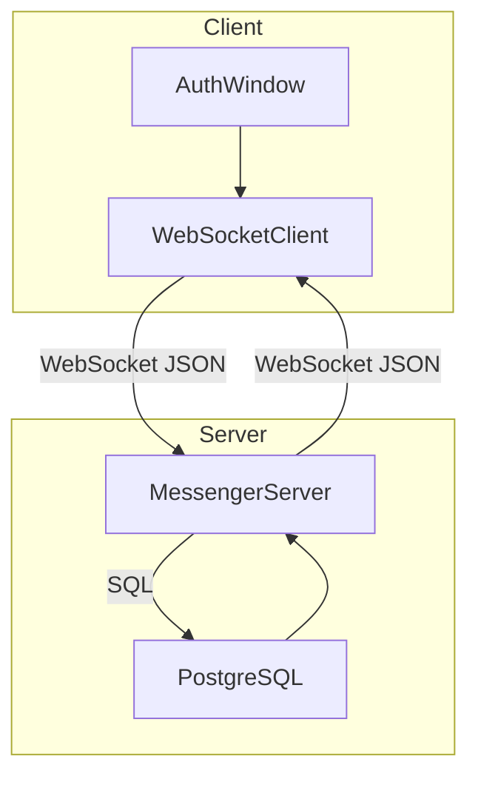
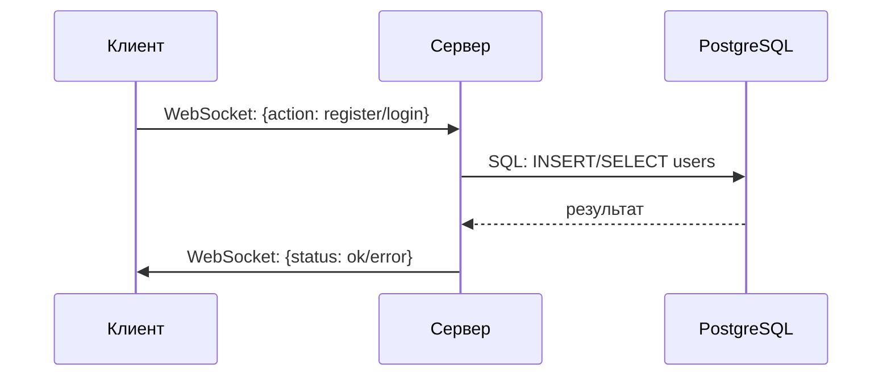

# Messenger

> Pet-проект для изучения клиент-серверного взаимодействия, современных сетевых протоколов и работы с реляционной БД.

---

## О проекте

**Messenger** — учебное приложение, показывающее базовые принципы построения мессенджера на C++ и Qt5. Проект состоит из двух частей: серверной и клиентской, реализующих регистрацию, вход и обмен сообщениями в реальном времени через WebSocket.  
Основная цель — изучить практику построения сетевого приложения, освоить работу с TCP/IP, WebSocket, взаимодействие с PostgreSQL и разработку GUI на Qt.

---

## Функциональность

- **Сервер:**
  - Запуск WebSocket-сервера на Qt5 для обработки клиентских соединений.
  - База данных PostgreSQL: хранение пользователей, проверка логина и пароля, регистрация.
  - Приём и обработка JSON-команд от клиента: регистрация, вход, обмен сообщениями.
  - Логирование операций и ошибок.
- **Клиент:**
  - Графический интерфейс на QtWidgets (окно авторизации, вход/регистрация).
  - WebSocket-клиент для обмена данными с сервером.
  - Отправка команд регистрации и входа, получение результатов, обработка ошибок.
  - Подготовка основы для реализации полноценного окна чата.

---

## Архитектура

## Архитектура



### Описание архитектуры

- **Client**  
  Включает окно авторизации (AuthWindow) и компонент для работы с WebSocket (WebSocketClient).  
  WebSocketClient отправляет JSON-команды серверу и получает ответы.
- **Server**  
  MessengerServer принимает соединения по WebSocket, выполняет обработку команд, взаимодействует с базой данных PostgreSQL для проверки, регистрации пользователей и хранения сообщений.
- Данные между клиентом и сервером передаются в формате JSON.

---

## Технологический стек

| Компонент      | Назначение                                   |
|----------------|----------------------------------------------|
| **C++**        | Язык реализации логики клиента и сервера     |
| **Qt5**        | Фреймворк для GUI, сетей, работы с БД        |
| **WebSocket**  | Протокол обмена сообщениями в реальном времени |
| **PostgreSQL** | Хранение пользователей и сообщений           |
| **CMake**      | Кроссплатформенная система сборки            |
| **Docker**     | (Планируется) Контейнеризация                |
| **CI/CD**      | (Планируется) Автоматизация сборки и тестов  |

---

## Подробности реализации

### Сервер

- **MessengerServer** запускает WebSocket-сервер и слушает входящие соединения.
- Для каждого нового клиента создаётся обработчик, который:
  - Принимает JSON-команды (`register`, `login`, в будущем — отправка сообщений).
  - Выполняет SQL-запросы к PostgreSQL: регистрация, вход, проверка пароля.
  - Формирует JSON-ответы для клиента.
- Используется таймер для периодической отправки ping-пакетов, отслеживания соединений.
- Пароли хранятся в базе в открытом виде — требуется внедрение хэширования.

### Клиент

- **AuthWindow** — окно авторизации, реализованное на QtWidgets.
- **WebSocketClient** — компонент для подключения к серверу по WebSocket, отправки команд и приёма ответов.
- Вся коммуникация между клиентом и сервером идёт по JSON через WebSocket.
- На данный момент реализованы функции регистрации и входа.  
  В планах — полноценный чат и отображение истории сообщений.

---

## Схема взаимодействия



---

## План развития

### 1. Базовые улучшения

- [ ] Реализовать хранение и передачу сообщений между пользователями (таблица сообщений, логика чата)
- [ ] Добавить обработку ошибок и подробные сообщения для пользователя
- [ ] Доработать клиентский интерфейс: окно чата, список пользователей, индикация статуса

### 2. Безопасность

- [ ] Хэшировать пароли пользователей (например, через bcrypt)
- [ ] Валидировать входные данные на клиенте и сервере
- [ ] Перейти на защищённое соединение (wss/WebSocket Secure)

### 3. Расширение функционала

- [ ] Групповые чаты и публичные каналы
- [ ] Передача файлов и изображений
- [ ] Push-уведомления о новых событиях

### 4. DevOps и контейнеризация

- [ ] Docker-файлы для сервера и клиента
- [ ] CI/CD: сборка, тестирование и деплой через GitHub Actions
- [ ] Подробная документация по установке и запуску

### 5. Модернизация и интеграции

- [ ] Веб-клиент на современном JS-фреймворке (React, Vue, Svelte)
- [ ] REST API для внешних приложений и интеграций
- [ ] Перспектива перехода к микросервисной архитектуре (разделение на сервисы аутентификации, сообщений и пр.)

---

## Как запустить

### Сервер

```bash
cd Server
cmake .
make
./Server
```

### Клиент

```bash
cd Client
cmake .
make
./Client
```

---

## Лицензия

Проект распространяется на условиях лицензии [MIT](LICENSE).

```
MIT License

Copyright (c) 2025 Ky0k01

Permission is hereby granted, free of charge, to any person obtaining a copy
of this software and associated documentation files (the "Software"), to deal
in the Software without restriction, including without limitation the rights
to use, copy, modify, merge, publish, distribute, sublicense, and/or sell
copies of the Software, and to permit persons to whom the Software is
furnished to do so, subject to the following conditions:

The above copyright notice and this permission notice shall be included in all
copies or substantial portions of the Software.

THE SOFTWARE IS PROVIDED "AS IS", WITHOUT WARRANTY OF ANY KIND, EXPRESS OR
IMPLIED, INCLUDING BUT NOT LIMITED TO THE WARRANTIES OF MERCHANTABILITY,
FITNESS FOR A PARTICULAR PURPOSE AND NONINFRINGEMENT. IN NO EVENT SHALL THE
AUTHORS OR COPYRIGHT HOLDERS BE LIABLE FOR ANY CLAIM, DAMAGES OR OTHER
LIABILITY, WHETHER IN AN ACTION OF CONTRACT, TORT OR OTHERWISE, ARISING FROM,
OUT OF OR IN CONNECTION WITH THE SOFTWARE OR THE USE OR OTHER DEALINGS IN THE
SOFTWARE.
```

---

## TODO

- [ ] Реализация истории сообщений
- [ ] Группы и публичные каналы
- [ ] Мобильный клиент (Qt/QML)
- [ ] Локализация и поддержка языков

---
