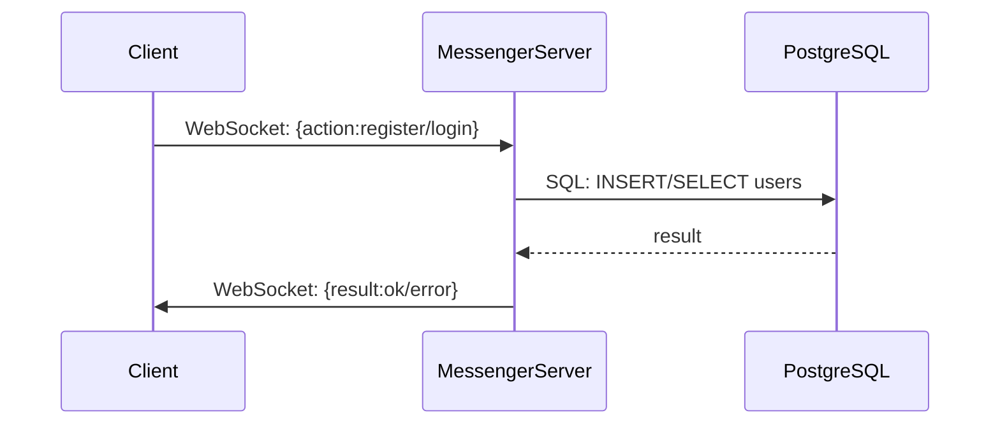
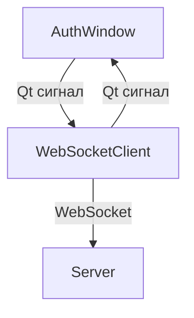

# Messenger

> Pet-проект для изучения работы с TCP/IP, WebSocket и PostgreSQL

---

## О проекте

Messenger — учебное клиент-серверное приложение на C++ и Qt5 для обмена сообщениями, реализующее базовые функции чата, регистрацию и аутентификацию пользователей. Проект строится на принципах реального времени и расширяемости.

---

## Архитектура

```mermaid
flowchart TD
    subgraph CLIENT
        AC[AuthWindow (QtWidget)]
        WC[WebSocketClient]
    end

    subgraph SERVER
        S[MessengerServer]
        DB[(PostgreSQL)]
    end

    AC -- user input --> WC
    WC -- WebSocket JSON --> S
    S -- SQL --> DB
    S -- WebSocket JSON --> WC
    DB -- data --> S
```

---

## Стек технологий

| Компонент      | Описание                                      |
|----------------|-----------------------------------------------|
| C++            | Язык реализации логики клиента и сервера      |
| Qt5            | Фреймворк, модули Core, Widgets, WebSockets, Sql |
| WebSocket      | Протокол обмена сообщениями в реальном времени|
| PostgreSQL     | Хранение пользователей и сообщений            |
| CMake          | Система сборки                                |
| Docker         | (Планируется) Контейнеризация                 |
| CI/CD          | (Планируется) Автоматизация сборки и тестирования |

---

## Текущая функциональность

- Регистрация и вход пользователей (WebSocket + PostgreSQL)
- Базовая обработка ошибок
- GUI-окно авторизации клиента
- Стартовая архитектура для обмена сообщениями

---

## Планы развития

### 1. Базовая доработка

- [ ] Реализовать хранение и передачу сообщений между пользователями
- [ ] Улучшить логику обработки ошибок и валидацию данных
- [ ] Сделать полноценное окно чата с отображением сообщений и списка пользователей

### 2. Безопасность

- [ ] Хэширование паролей (bcrypt)
- [ ] Валидация входных данных
- [ ] Шифрование WebSocket-соединения (wss)

### 3. Расширение функционала

- [ ] Групповые чаты
- [ ] Передача файлов
- [ ] Push-уведомления

### 4. DevOps и масштабирование

- [ ] Docker-файл для сервера/клиента
- [ ] CI/CD (GitHub Actions)
- [ ] Документация по запуску и использованию

### 5. Модернизация стека

- [ ] Веб-клиент на React/Vue/Svelte
- [ ] REST API для внешних интеграций
- [ ] Перспектива микросервисной архитектуры

---

## Схема компонентов

### Сервер



### Клиент



---

## Лицензия

MESSENGER распространяется на условиях лицензии [MIT](LICENSE).

```
MIT License

Copyright (c) 2025 Ky0k01

Permission is hereby granted, free of charge, to any person obtaining a copy...
[Полный текст лицензии MIT ниже]
```

---

## Контакты и вклад

- Открыто для фидбека и pull-request'ов
- Для предложений и вопросов — создавайте Issues!

---

## Запуск

### Сервер

```bash
cd Server
cmake .
make
./Server
```

### Клиент

```bash
cd Client
cmake .
make
./Client
```

---

## TODO

- [ ] Полная поддержка истории сообщений
- [ ] Группы и публичные каналы
- [ ] Мобильный клиент (Qt/QML)
- [ ] Локализация и поддержка языков

---

## Благодарности

- Qt — за удобный фреймворк
- PostgreSQL — за надежную БД

---

## MIT License

```
MIT License

Copyright (c) 2025 Ky0k01

Permission is hereby granted, free of charge, to any person obtaining a copy
of this software and associated documentation files (the "Software"), to deal
in the Software without restriction, including without limitation the rights
to use, copy, modify, merge, publish, distribute, sublicense, and/or sell
copies of the Software, and to permit persons to whom the Software is
furnished to do so, subject to the following conditions:

The above copyright notice and this permission notice shall be included in all
copies or substantial portions of the Software.

THE SOFTWARE IS PROVIDED "AS IS", WITHOUT WARRANTY OF ANY KIND, EXPRESS OR
IMPLIED, INCLUDING BUT NOT LIMITED TO THE WARRANTIES OF MERCHANTABILITY,
FITNESS FOR A PARTICULAR PURPOSE AND NONINFRINGEMENT. IN NO EVENT SHALL THE
AUTHORS OR COPYRIGHT HOLDERS BE LIABLE FOR ANY CLAIM, DAMAGES OR OTHER
LIABILITY, WHETHER IN AN ACTION OF CONTRACT, TORT OR OTHERWISE, ARISING FROM,
OUT OF OR IN CONNECTION WITH THE SOFTWARE OR THE USE OR OTHER DEALINGS IN THE
SOFTWARE.
```
